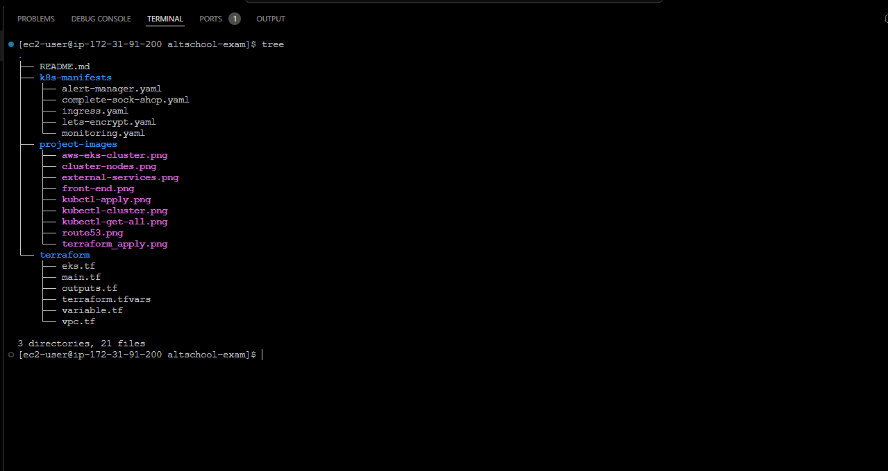
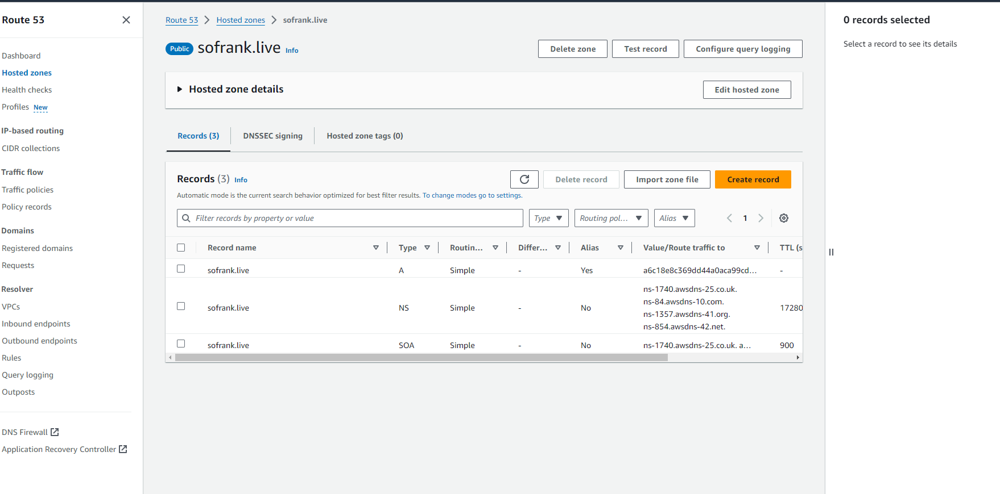

# A MICROSERVICES-BASED ARCHITECTURAL APPLICATION DEPLOYED ON KUBERNATES MAKING USE OF IAC.

## **PROJECT LINK:** [CAPSTONE PROJECT](https://ruobt-zgpvh.maillist-manage.net/click/110ae8677e214214e/110ae8677e2141c1a)
<br>

### **Project Overview:**
We aim to deploy a microservices-based application, specifically the Socks Shop,
using a modern approach emphasizing automation and efficiency. The goal is to use
Infrastructure as Code (IAC) for rapid and reliable deployment on Kubernetes.
<br>
<br>
### **Project Instructions:**<br>
● All deliverables need to be deployed using an infrastructure-as-code approach.<br>
● In your solution please emphasize readability and maintainability (make your
application deployment clear). <br>
● We expect a clear way to recreate your setup and will evaluate the project decisions
based on:
- Deploy pipeline
- Metrics (Alertmanager)
- Monitoring (Grafana)
- Logging (Prometheus)

● Use Prometheus as a monitoring tool. <br>
● Use Ansible or Terraform as the configuration management tool.<br>
● You can use an IaaS provider of your choice.<br>
● The application should run on Kubernetes.
<br>

**PROJECT STRUCTURE**


<br>
<br>
GETTING STARTED 
<br>
<br>

### **Resources:** 
<br>

- Socks Shop Microservices Demo: [GitHub Repository](https://github.com/microservices-demo/microservices-demo.github.io)
- Detailed Implementation Guide: [GitHub Repository](https://github.com/microservices-demo/microservices-demo/tree/master)
<br>

## **Infrastructure Provisioning:**
<br>

1. Git clone this repository and navigate to the ```terraform``` folder to have the Terraform configuration files and initiate the Terraform project. 

```sh
git clone https://github.com/Sofrank/altschool-exam.git
```
2. Navigate to the ```terraform``` directory for the Terraform configuration files using this command:
```sh
cd terraform
```

3. Run the following command to initialize the Terraform project:
```sh
terraform init
```

4. Run the following command to create an execution plan:
```sh
terraform plan
```
5. Run the following command to apply the changes:
```sh
terraform apply --auto-approve

# The --auto-approve flag has been added to avoid the prompt for confirmation.
```
<br>

**PROVISION OF MY EKS CLUSTER BY TERRAFORM:**


6. Run the command below to configure Kubectl to connect to the EKS cluster.
```
aws eks update-kubeconfig --region us-east-1 --name Altschool-Exam-cluster
```
7. Apply deployment manifests to my cluster using the following command:
  ```
 kubectl apply -f ./k8s-manifests/
```


8. You can use the command below to get all the resources deployed to the ```Altschool-Exam-cluster```
   ```
   kubectl get-All 
   ```


9. After we confirm that our pods are running, we can now test the application by port-forwarding the service to our local machine using the following command:
 ```
kubectl port-forward service/front-end -n sock-shop 30001:80
 ```


## **MONITORING**
<br>
Prometheus will be used to monitor the performance and health of the Socks Shop application. This will include metrics such as request latency, error rate, and request volume. The Prometheus server will be configured to scrape metrics from the Socks Shop application and store them in a time-series database. <br> 
Grafana will be used to visualize the metrics and create dashboards to monitor the performance and health of the application. <br>

You can find manifests for these in the ``` k8s-manifests ```
<br>

### - **Prometheus**


<br>

### - **Grafana**



<br>

### **CI/CD**
GitHub Actions was used to automate the provisioning of Infrastructure and the deployment of the sock shop manifest to AWS EKS Cluster using the Terraform actions plugin.
The code can be found here [.github/workflows/deploy.yaml](./.github/workflows/deploy.yaml)

## **CONCLUSION:** 
This project provides hands-on experience with Infrastructure such as Code, Kubernetes, DevOps best practices, CI/CD, and cloud security. It also demonstrates the value of automation and monitoring in ensuring the reliability and performance of microservices-based applications. By the end of the project, I have a fully functional deployment pipeline for the Socks Shop application, including infrastructure provisioning, monitoring, logging, and security. 
